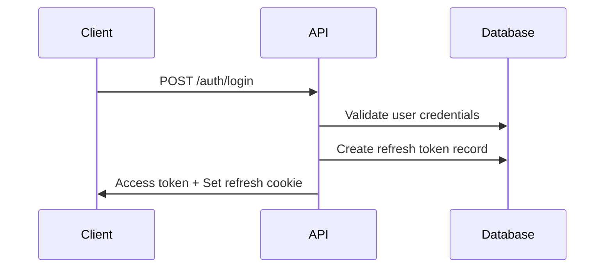
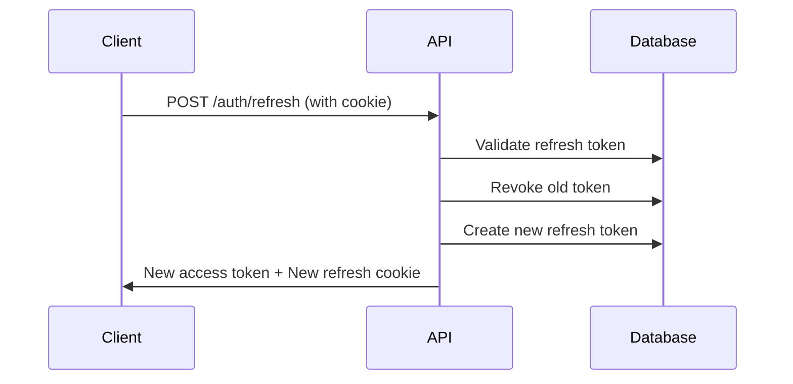
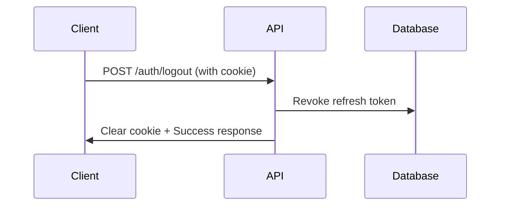

# Système d'Authentification avec Refresh Tokens

## Vue d'ensemble

Ce système implémente une authentification JWT avec refresh tokens rotatifs pour une sécurité renforcée. Les refresh tokens sont stockés en base de données et utilisés via des cookies HttpOnly.

## Architecture

### Composants principaux

1. **Access Tokens** : JWT de courte durée (15 minutes par défaut) pour l'authentification des requêtes API
2. **Refresh Tokens** : JWT de longue durée (30 jours par défaut) stockés en base et utilisés pour renouveler les access tokens
3. **Rotation des tokens** : Chaque refresh génère un nouveau refresh token et révoque l'ancien
4. **Détection de réutilisation** : Si un refresh token révoqué est réutilisé, toutes les sessions de l'utilisateur sont révoquées

### Modèle de données

```prisma
model RefreshToken {
  id           String   @id @default(cuid())
  userId       String   @db.Uuid
  user         User     @relation(fields: [userId], references: [id], onDelete: Cascade)
  
  jti          String   @unique              // ID logique du refresh (JWT ID)
  tokenHash    String                        // hash du refresh token (pas de stockage en clair)
  userAgent    String?                       // forensics / device management
  ip           String?                       // forensics
  createdAt    DateTime @default(now())
  expiresAt    DateTime
  revokedAt    DateTime?                     // null = actif
  replacedById String?                       // jti du nouveau token (pour détecter la réutilisation)
}
```

## Configuration

### Variables d'environnement

```env
# JWT Configuration
JWT_ACCESS_SECRET=your_access_secret_here
JWT_REFRESH_SECRET=your_refresh_secret_here
JWT_ACCESS_TTL=15m
JWT_REFRESH_TTL=30d

# Auth Cookie Configuration
AUTH_COOKIE_NAME=__Host-refresh_token
AUTH_COOKIE_DOMAIN=
AUTH_COOKIE_SECURE=true
AUTH_COOKIE_SAMESITE=lax

# CORS Configuration
API_CORS_ORIGIN=http://localhost:3001
```

### Sécurité des cookies

- **HttpOnly** : Empêche l'accès JavaScript côté client
- **Secure** : Transmission uniquement via HTTPS (en production)
- **SameSite** : Protection contre les attaques CSRF
- **Path** : Limité à `/auth/refresh` pour minimiser l'exposition
- **Prefix `__Host-`** : Force Secure=true, Path=/, et pas de Domain

## Endpoints API

### POST /auth/login

Authentifie un utilisateur et retourne un access token avec un refresh token en cookie.

**Request:**
```json
{
  "email": "user@example.com",
  "password": "password123"
}
```

**Response:**
```json
{
  "access_token": "eyJhbGciOiJIUzI1NiIsInR5cCI6IkpXVCJ9...",
  "expires_in": 900,
  "user": {
    "id": "uuid",
    "email": "user@example.com",
    "org_id": "uuid",
    "role": "admin",
    "permissions": ["users.read", "users.write"]
  }
}
```

**Cookie:** `__Host-refresh_token` (HttpOnly, Secure, Path=/auth/refresh)

### POST /auth/refresh

Renouvelle l'access token en utilisant le refresh token du cookie.

**Request:** Aucun body, utilise le cookie refresh token

**Response:**
```json
{
  "access_token": "eyJhbGciOiJIUzI1NiIsInR5cCI6IkpXVCJ9...",
  "expires_in": 900
}
```

**Cookie:** Nouveau refresh token (rotation)

### POST /auth/logout

Révoque le refresh token et supprime le cookie.

**Request:** Aucun body

**Response:**
```json
{
  "ok": true
}
```

## Flux d'authentification

### 1. Connexion initiale



### 2. Renouvellement de token



### 3. Déconnexion



## Sécurité

### Mesures de protection

1. **Stockage sécurisé** : Les refresh tokens ne sont jamais stockés en clair (hash SHA-256)
2. **Rotation automatique** : Chaque refresh génère un nouveau token
3. **Détection de réutilisation** : Révocation de toutes les sessions en cas de token compromis
4. **Expiration** : Tokens avec durée de vie limitée
5. **Forensics** : Stockage de l'IP et User-Agent pour audit
6. **CORS strict** : Origin spécifique avec credentials

### Gestion des attaques

- **Token theft** : Rotation limite l'impact
- **Replay attacks** : Tokens à usage unique
- **Session fixation** : Nouveaux tokens à chaque refresh
- **CSRF** : Cookies SameSite + tokens dans headers séparés

## Intégration côté client

### Configuration Axios (exemple)

```javascript
import axios from 'axios';

const api = axios.create({
  baseURL: 'http://localhost:3000',
  withCredentials: true, // Important pour les cookies
});

// Intercepteur pour refresh automatique
api.interceptors.response.use(
  (response) => response,
  async (error) => {
    if (error.response?.status === 401) {
      try {
        await api.post('/v1/auth/refresh');
        // Retry original request
        return api.request(error.config);
      } catch (refreshError) {
        // Redirect to login
        window.location.href = '/login';
      }
    }
    return Promise.reject(error);
  }
);
```

## Tests

### Tests e2e inclus

- Login avec cookie refresh
- Refresh token rotation
- Logout avec suppression cookie
- Détection de réutilisation
- Gestion des erreurs

### Exécution des tests

```bash
npm run test:e2e -- --testNamePattern="Auth Refresh"
```

## Déploiement

### Prérequis

1. Exécuter les migrations Prisma
2. Régénérer le client Prisma
3. Configurer les variables d'environnement
4. Installer les dépendances (`cookie-parser`)

### Commandes

```bash
# Migration et génération
npm run docker:migrate
npm run docker:generate

# Installation des dépendances
npm install

# Tests
npm run test:e2e
```

## Monitoring et maintenance

### Nettoyage des tokens expirés

Créer une tâche cron pour supprimer les refresh tokens expirés :

```sql
DELETE FROM refresh_tokens 
WHERE expires_at < NOW() OR revoked_at IS NOT NULL;
```

### Métriques à surveiller

- Nombre de refresh tokens actifs par utilisateur
- Fréquence des détections de réutilisation
- Durée de vie moyenne des sessions
- Erreurs d'authentification

## Troubleshooting

### Erreurs communes

1. **Cookie not set** : Vérifier CORS et `withCredentials`
2. **Token rotation fails** : Vérifier la synchronisation DB
3. **CSRF errors** : Vérifier SameSite configuration
4. **Prisma errors** : Régénérer le client après migration
