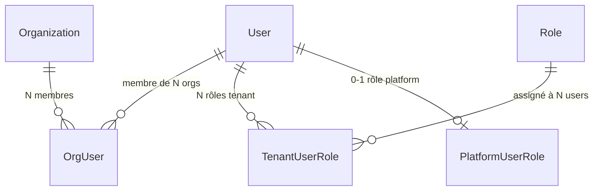
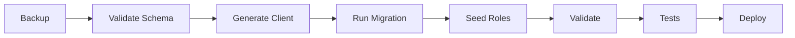

# STEP 1 - Multi-tenant Refactor

## 🎯 Vue d'ensemble

Ce refactor transforme l'application d'un modèle **single-tenant** vers un modèle **multi-tenant** fiable avec des contraintes DB strictes.

**Status** : ✅ PRÊT POUR IMPLÉMENTATION

---

## 📖 Documentation

### Commencer ici
- **[QUICK_REFERENCE.md](./QUICK_REFERENCE.md)** - ⚡ Référence rapide avec toutes les commandes
- **[README.md](./README.md)** - 📚 Vue d'ensemble complète du refactor

### Documentation détaillée
- **[STEP_1_MULTITENANT.md](./STEP_1_MULTITENANT.md)** - 📖 Documentation complète du modèle
- **[STEP_1_EXECUTION_GUIDE.md](./STEP_1_EXECUTION_GUIDE.md)** - 🚀 Guide d'exécution pas à pas
- **[STEP_1_DIAGRAMS.md](./STEP_1_DIAGRAMS.md)** - 📊 Diagrammes et schémas visuels

---

## 🗂️ Fichiers Techniques

### Schema & Migrations
- `prisma/schema.prisma` - Nouveau modèle Prisma
- `prisma/migrations/STEP1_MULTITENANT_REFACTOR/migration.sql` - Migration SQL complète

### Scripts
- `prisma/seeds/step1-multitenant.seed.ts` - Seed idempotent des rôles
- `scripts/validate-step1-migration.ts` - Script de validation

### Tests
- `test/step1-multitenant.spec.ts` - Tests de validation du modèle

---

## 🎬 Quick Start

```bash
# 1. Backup obligatoire
pg_dump -U postgres -d attendee_ems > backup.sql

# 2. Appliquer la migration
npx prisma generate
npx prisma migrate deploy

# 3. Seed les rôles
npm run db:seed:step1

# 4. Valider
npm run db:validate:step1
npm test -- step1-multitenant.spec.ts
```

📖 **Guide complet** : [STEP_1_EXECUTION_GUIDE.md](./STEP_1_EXECUTION_GUIDE.md)

---

## 🔑 Concepts Clés

### Avant (Single-tenant)
```
User → 1 Org → 1 Role
```

### Après (Multi-tenant)
```
User → N Orgs → N Roles (1 par org)
     ↘ 1 Role Platform (optionnel)
```

### Nouveaux Modèles

| Modèle | Description |
|--------|-------------|
| `OrgUser` | Membership (user ↔ org) |
| `TenantUserRole` | 1 rôle tenant par user par org |
| `PlatformUserRole` | 1 rôle platform max par user |
| `PlatformUserOrgAccess` | Orgs accessibles (platform assigned) |

---

## 🛡️ Garanties DB

- ✅ Email unique global
- ✅ 1 rôle tenant actif par user par org (UNIQUE)
- ✅ 1 rôle platform max par user (UNIQUE)
- ✅ User doit être membre de l'org (FK composite)
- ✅ Rôle doit appartenir à l'org (FK composite)
- ✅ Triggers empêchent cross-assignments (tenant ↔ platform)

---

## 📊 Diagrammes



📊 **Plus de diagrammes** : [STEP_1_DIAGRAMS.md](./STEP_1_DIAGRAMS.md)

---

## 🧪 Tests

### Lancer les tests
```bash
# Tests unitaires du modèle
npm test -- step1-multitenant.spec.ts

# Validation complète
npm run db:validate:step1

# Tests E2E
npm run test:e2e
```

### Tests manuels
```bash
# Ouvrir Prisma Studio
npx prisma studio

# Connexion PostgreSQL
psql -U postgres -d attendee_ems
```

---

## 🎯 Scénarios d'Utilisation

### Scénario 1 : User Multi-tenant
Alice est Admin dans Org A et Viewer dans Org B

```typescript
// Memberships
await prisma.orgUser.createMany({
  data: [
    { user_id: 'alice', org_id: 'org-a' },
    { user_id: 'alice', org_id: 'org-b' },
  ],
});

// Rôles
await prisma.tenantUserRole.createMany({
  data: [
    { user_id: 'alice', org_id: 'org-a', role_id: 'role-admin-a' },
    { user_id: 'alice', org_id: 'org-b', role_id: 'role-viewer-b' },
  ],
});
```

### Scénario 2 : Support Agent (Platform Assigned)
Bob est support avec accès à 3 orgs spécifiques

```typescript
// Rôle platform
await prisma.platformUserRole.create({
  data: {
    user_id: 'bob',
    role_id: 'role-support',
    scope: 'assigned',
  },
});

// Accès limités
await prisma.platformUserOrgAccess.createMany({
  data: [
    { user_id: 'bob', org_id: 'org-1' },
    { user_id: 'bob', org_id: 'org-2' },
    { user_id: 'bob', org_id: 'org-3' },
  ],
});
```

### Scénario 3 : Root Administrator
Charlie est root avec accès complet

```typescript
await prisma.platformUserRole.create({
  data: {
    user_id: 'charlie',
    role_id: 'role-root',
    scope: 'all',
  },
});
// → Bypass toute la logique d'autorisation
```

---

## 🔄 Processus de Migration



**Durée estimée** : 1h45

---

## 📋 Checklist

### Avant la migration
- [ ] Lire la documentation complète
- [ ] Comprendre les nouveaux modèles
- [ ] Planifier une fenêtre de maintenance
- [ ] Préparer le rollback

### Pendant la migration
- [ ] Backup de la base de données
- [ ] Valider le schéma (`npx prisma validate`)
- [ ] Générer le client (`npx prisma generate`)
- [ ] Appliquer la migration (`npx prisma migrate deploy`)
- [ ] Exécuter le seed (`npm run db:seed:step1`)

### Après la migration
- [ ] Validation automatique (`npm run db:validate:step1`)
- [ ] Tests unitaires (`npm test -- step1-multitenant.spec.ts`)
- [ ] Vérifications manuelles (Prisma Studio)
- [ ] Tests d'intégration
- [ ] Monitoring des erreurs
- [ ] Documentation des changements

---

## 🆘 En Cas de Problème

### Rollback immédiat
```bash
# Restaurer le backup
psql -U postgres -d attendee_ems < backup.sql
```

### Debug
```bash
# Vérifier l'état des migrations
npx prisma migrate status

# Voir les logs
docker-compose logs -f api

# Connexion DB pour diagnostic
psql -U postgres -d attendee_ems
```

### Support
1. Consulter [STEP_1_EXECUTION_GUIDE.md](./STEP_1_EXECUTION_GUIDE.md)
2. Exécuter `npm run db:validate:step1`
3. Vérifier les logs d'erreur
4. Consulter la section Troubleshooting

---

## 🚀 Prochaines Étapes

Après STEP 1, voir :
- **STEP 2** : Authorization Service (logique applicative)
- **STEP 3** : Role Propagation (templates)
- **STEP 4** : Advanced RBAC (conditions, feature flags)

📖 **Roadmap complète** : [README.md](./README.md)

---

## 📚 Références Utiles

### Documentation Interne
- [ARCHITECTURE_RBAC.md](../ARCHITECTURE_RBAC.md)
- [DECISION_NO_CASL.md](../DECISION_NO_CASL.md)
- [DATABASE_SCHEMA.md](../DATABASE_SCHEMA.md)

### Documentation Externe
- [Prisma Documentation](https://www.prisma.io/docs)
- [PostgreSQL Constraints](https://www.postgresql.org/docs/current/ddl-constraints.html)
- [NestJS Guards](https://docs.nestjs.com/guards)

---

## 📞 Support

**Questions ?**
- Consulter la documentation
- Exécuter les scripts de validation
- Vérifier les tests

**Problèmes techniques ?**
- Voir [STEP_1_EXECUTION_GUIDE.md](./STEP_1_EXECUTION_GUIDE.md) section Troubleshooting
- Exécuter `npm run db:validate:step1`
- Consulter les logs

---

**Date de création** : 4 Janvier 2026  
**Version** : 1.0  
**Auteur** : GitHub Copilot  
**Status** : ✅ Prêt pour implémentation
