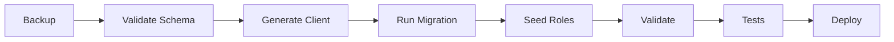

# 📚 Index - Refactoring RBAC Multi-Tenant

> **Guide complet du refactoring progressif vers une architecture hexagonale RBAC**

## 🎯 Vue d'ensemble

Ce refactoring transforme l'application en plusieurs phases séquentielles pour éviter tout retour en arrière :

1. **STEP 1** : Base de données multi-tenant ✅ **COMPLÉTÉ**
2. **STEP 2** : JWT multi-organisation 📋 **À IMPLÉMENTER**
3. **STEP 3** : Core RBAC hexagonal 📋 **À IMPLÉMENTER**
4. **STEP 4** : Refactor services 📋 **À IMPLÉMENTER**
5. **STEP 5** : Provisioning (automatisation) 📋 **PRÉPARATOIRE**
6. **STEP 6** : Module Gating (plans) 📋 **PRÉPARATOIRE**

---

## 📖 Documentation par STEP

### ✅ STEP 1 : Multi-Tenant Database (COMPLÉTÉ)

**Objectif** : Transformer la DB en modèle multi-tenant avec contraintes strictes

- **[STEP_1_MULTITENANT.md](./STEP_1_MULTITENANT.md)** - Documentation complète + REX
- **[STEP_1_EXECUTION_GUIDE.md](./STEP_1_EXECUTION_GUIDE.md)** - Guide d'exécution
- **[STEP_1_DIAGRAMS.md](./STEP_1_DIAGRAMS.md)** - Schémas visuels

**Résultats** :
- ✅ Migration appliquée (User → OrgUser + TenantUserRole)
- ✅ 22/22 tests d'intégration passés
- ✅ 21/21 validations DB passées
- ✅ Triggers check_platform_role et check_tenant_role

---

### 📋 STEP 2 : JWT Multi-Org (À IMPLÉMENTER)

**Objectif** : Ajouter `currentOrgId` au JWT et permettre le switch d'organisation

- **[STEP_2_JWT_MULTI_ORG.md](./STEP_2_JWT_MULTI_ORG.md)**

**Ce qui sera fait** :
- JwtPayload avec `currentOrgId` et `availableOrgs[]`
- Endpoint `/auth/switch-org/:orgId`
- TenantContextGuard pour injecter le contexte
- Refresh token avec gestion du currentOrgId

**Prérequis** : ✅ STEP 1 complété  
**Durée estimée** : 1-2 jours

---

### 📋 STEP 3 : Core RBAC Hexagonal (À IMPLÉMENTER)

**Objectif** : Créer le core RBAC avec architecture hexagonale (Ports & Adapters)

- **[STEP_3_CORE_RBAC.md](./STEP_3_CORE_RBAC.md)**

**Ce qui sera fait** :
- AuthorizationService (core domain)
- ScopeEvaluator et PermissionResolver
- Interfaces SPI (RbacQueryPort, MembershipPort)
- Adapters Prisma
- RequirePermissionGuard et @RequirePermission decorator

**Prérequis** : ✅ STEP 2 complété  
**Durée estimée** : 2-3 jours

---

### 📋 STEP 4 : Refactor Services (À IMPLÉMENTER)

**Objectif** : Migrer tous les services vers le nouveau modèle RBAC multi-tenant

- **[STEP_4_REFACTOR_SERVICES.md](./STEP_4_REFACTOR_SERVICES.md)**

**Ce qui sera fait** :
- Migration des services (UsersService, EventsService, AttendeesService, etc.)
- Transactions pour créer User + OrgUser + TenantUserRole
- Queries avec joins sur org_users
- Controllers avec @RequirePermission
- Adaptation des tests

**Prérequis** : ✅ STEP 3 complété  
**Durée estimée** : 3-5 jours

---

### 🔧 STEP 5 : Provisioning (DOCUMENTATION PRÉPARATOIRE)

**Objectif** : Automatiser la gestion des rôles/permissions à grande échelle

- **[STEP_5_PROVISIONING.md](./STEP_5_PROVISIONING.md)**

**Ce qui sera fait** :
- ProvisioningService (créer rôles pour nouvelle org)
- PropagationService (propager permissions à toutes les orgs)
- Templates de rôles (ADMIN, MANAGER, VIEWER)
- CLI commands (provision-org, propagate-permission)

**Prérequis** : ✅ STEP 1-4 complétés  
**Priorité** : 🟡 MOYEN (amélioration scalabilité)

---

### 🔧 STEP 6 : Module Gating (DOCUMENTATION PRÉPARATOIRE)

**Objectif** : Restreindre l'accès aux modules selon le plan de l'organisation

- **[STEP_6_MODULE_GATING.md](./STEP_6_MODULE_GATING.md)**

**Ce qui sera fait** :
- ModuleGatingService (vérifier accès module)
- Plans (FREE, PRO, ENTERPRISE) avec modules inclus
- RequireModuleGuard et @RequireModule decorator
- Limites par plan (maxEvents, maxAttendees, etc.)

**Prérequis** : ✅ STEP 1-5 complétés  
**Priorité** : 🟡 MOYEN (monétisation)

---

## 🗺️ Roadmap Complète

### Phase 1 : Fondation Multi-Tenant (1-2 semaines)
- [x] **STEP 1** : DB multi-tenant ✅ **FAIT**
- [ ] **STEP 2** : JWT multi-org (1-2j)
- [ ] **STEP 3** : Core RBAC (2-3j)

### Phase 2 : Implémentation (2-3 semaines)
- [ ] **STEP 4** : Refactor services (3-5j)
- [ ] Tests d'intégration complets
- [ ] Documentation API mise à jour

### Phase 3 : Optimisation (optionnel)
- [ ] **STEP 5** : Provisioning automatique
- [ ] **STEP 6** : Module Gating & Plans
- [ ] Analytics et monitoring

---

## 🗂️ Fichiers Clés

### Schema & Migrations
- `prisma/schema.prisma` - Modèle Prisma multi-tenant
- `prisma/migrations/STEP1_MULTITENANT_REFACTOR/` - Migration STEP 1

### Core RBAC (à créer)
- `src/platform/authz/core/authorization.service.ts` - Service principal
- `src/platform/authz/guards/require-permission.guard.ts` - Guard NestJS
- `src/platform/authz/decorators/require-permission.decorator.ts` - Decorator

### Tests
- `test/step1-multitenant.spec.ts` - Tests STEP 1 ✅
- `test/jest-step1.json` - Config Jest STEP 1

---

## 🎬 Quick Start (STEP 1 - Déjà fait)

```bash
# Vérifier que STEP 1 est OK
npm run test:step1              # 22/22 tests doivent passer
npm run docker:validate:step1   # 21/21 validations doivent passer
```

---

## 🎬 Quick Start (STEP 2 - À faire)

```bash
# 1. Implémenter JwtPayload avec currentOrgId
# 2. Créer TenantContextGuard
# 3. Endpoint /auth/switch-org/:orgId
# 4. Tester le switch d'organisation
```

**Documentation** : [STEP_2_JWT_MULTI_ORG.md](./STEP_2_JWT_MULTI_ORG.md)

---

## 📚 Autres Documents

### STEP 1 (Multi-Tenant DB)
- [QUICK_REFERENCE.md](./QUICK_REFERENCE.md) - Référence rapide
- [README.md](./README.md) - Vue d'ensemble STEP 1
- [STEP_1_EXECUTION_GUIDE.md](./STEP_1_EXECUTION_GUIDE.md) - Guide d'exécution
- [STEP_1_DIAGRAMS.md](./STEP_1_DIAGRAMS.md) - Diagrammes

---

## 🆘 Support & Aide

### Problèmes courants

**Q : Les tests STEP 1 échouent**  
R : Vérifier que la migration est appliquée : `npx prisma migrate deploy`

**Q : Comment tester le multi-tenant ?**  
R : Voir les scénarios dans [STEP_1_MULTITENANT.md](./STEP_1_MULTITENANT.md)

**Q : Quelle est la prochaine étape ?**  
R : Implémenter STEP 2 (JWT multi-org), voir [STEP_2_JWT_MULTI_ORG.md](./STEP_2_JWT_MULTI_ORG.md)

---

## 🔄 Processus de Migration



**Durée estimée** : 1h45

---

## 📋 Checklist

### Avant la migration
- [ ] Lire la documentation complète
- [ ] Comprendre les nouveaux modèles
- [ ] Planifier une fenêtre de maintenance
- [ ] Préparer le rollback

### Pendant la migration
- [ ] Backup de la base de données
- [ ] Valider le schéma (`npx prisma validate`)
- [ ] Générer le client (`npx prisma generate`)
- [ ] Appliquer la migration (`npx prisma migrate deploy`)
- [ ] Exécuter le seed (`npm run db:seed:step1`)

### Après la migration
- [ ] Validation automatique (`npm run db:validate:step1`)
- [ ] Tests unitaires (`npm test -- step1-multitenant.spec.ts`)
- [ ] Vérifications manuelles (Prisma Studio)
- [ ] Tests d'intégration
- [ ] Monitoring des erreurs
- [ ] Documentation des changements

---

## 🆘 En Cas de Problème

### Rollback immédiat
```bash
# Restaurer le backup
psql -U postgres -d attendee_ems < backup.sql
```

### Debug
```bash
# Vérifier l'état des migrations
npx prisma migrate status

## 🔧 Commandes Utiles

```bash
# STEP 1 - Validation
npm run test:step1              # Tests intégration STEP 1
npm run docker:validate:step1   # Validation DB

# Développement
npx prisma studio               # Interface DB visuelle
npx prisma generate             # Régénérer le client Prisma

# Database
npm run docker:db:reset         # Reset + seed DB
docker-compose logs -f api      # Logs de l'API

# Connexion DB
psql -U postgres -d attendee_ems
```

---

## 📚 Références Utiles

### Documentation Interne
- [ARCHITECTURE_RBAC.md](../ARCHITECTURE_RBAC.md) - Architecture globale
- [DECISION_NO_CASL.md](../DECISION_NO_CASL.md) - Pourquoi pas CASL
- [DATABASE_SCHEMA.md](../DATABASE_SCHEMA.md) - Schéma DB complet

### Documentation Externe
- [Prisma Documentation](https://www.prisma.io/docs)
- [PostgreSQL Constraints](https://www.postgresql.org/docs/current/ddl-constraints.html)
- [NestJS Guards](https://docs.nestjs.com/guards)
- [Hexagonal Architecture](https://alistair.cockburn.us/hexagonal-architecture/)

---

## 📞 Support & Contribution

**Questions ?**
- Consulter la documentation des STEP correspondants
- Vérifier les tests et validations
- Consulter le [INDEX.md](./INDEX.md) pour une vue d'ensemble

**Problèmes techniques ?**
- Voir section "Support & Aide" ci-dessus
- Exécuter les scripts de validation
- Consulter les logs Docker

---

**Dernière mise à jour** : 4 Janvier 2026  
**Version** : 2.0 (refactor complet 6 STEPS)  
**Auteur** : GitHub Copilot  
**Status** : ✅ STEP 1 complété, STEP 2-6 documentés
