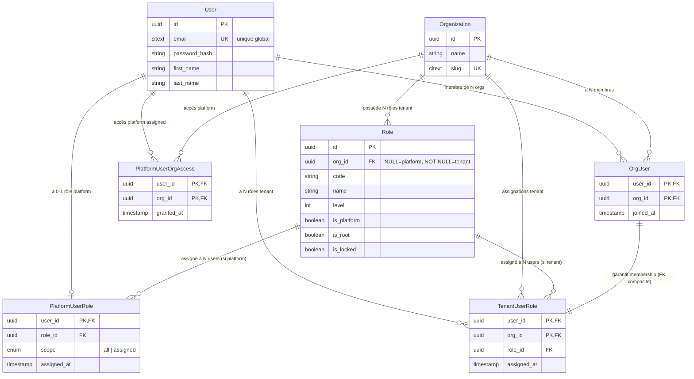
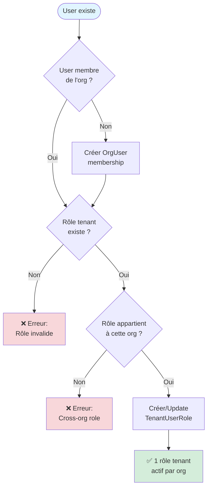
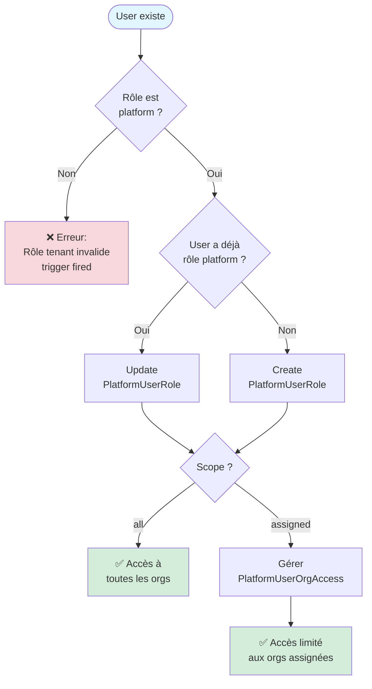
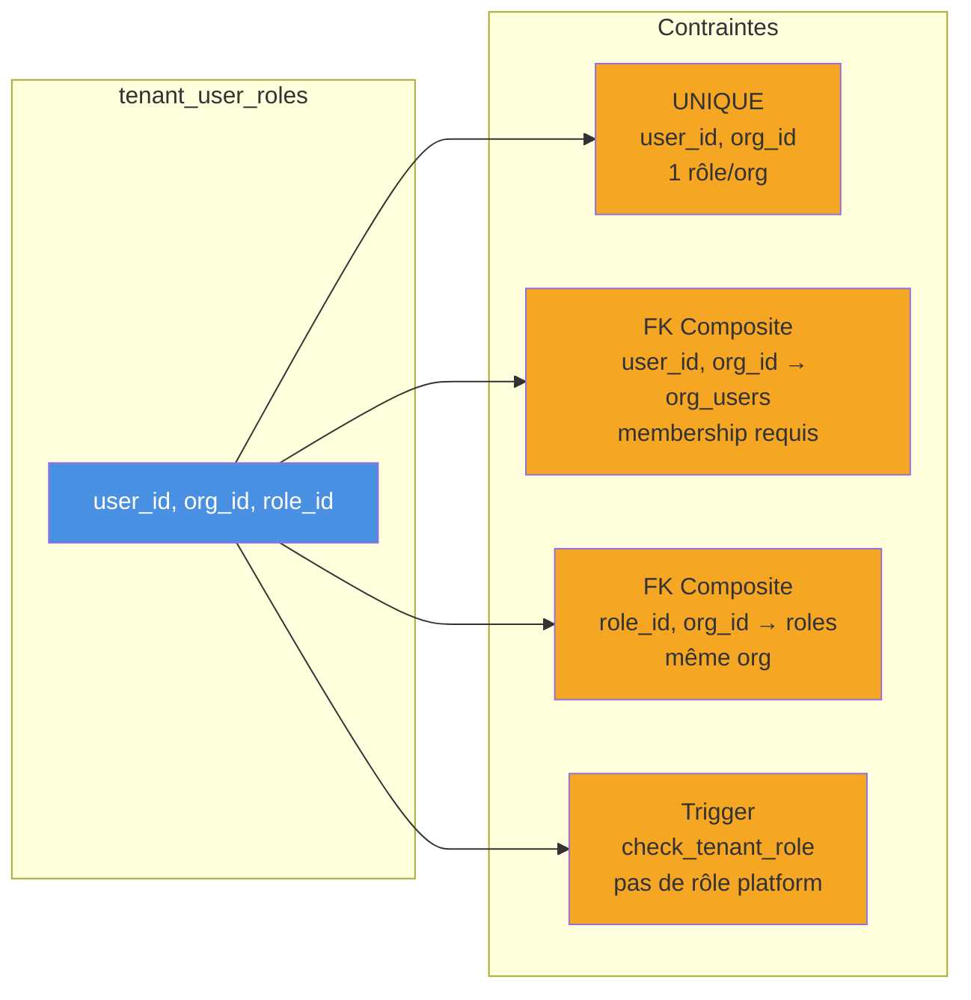
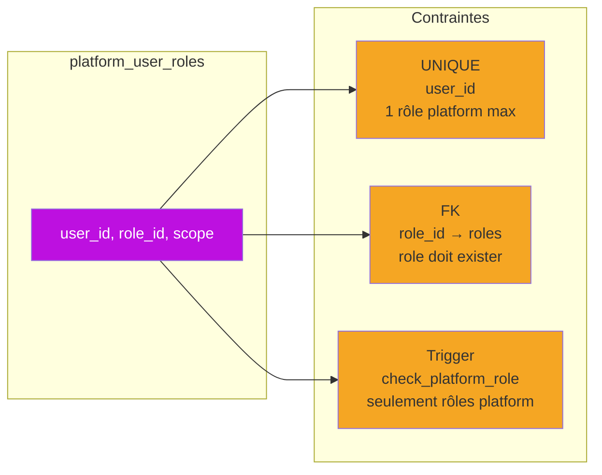
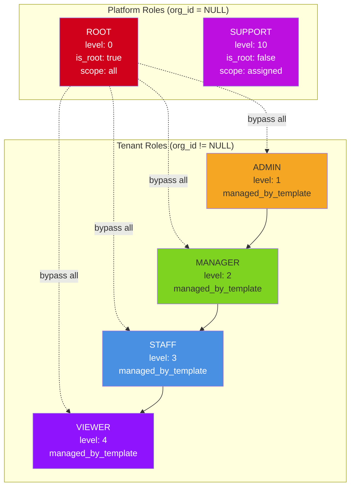

# Architecture Visuelle - Multi-tenant Model

## Vue d'ensemble du Modèle de Données



## Flux d'Assignation des Rôles

### Rôle Tenant (par organisation)



### Rôle Platform (global)



## Scénarios d'Utilisation

### Scénario 1 : User Multi-tenant

```mermaid
graph TB
    subgraph "User: Alice"
        A[alice@example.com]
    end
    
    subgraph "Organization A"
        OrgA[Org A]
        RoleAdminA[Role: Admin]
        A -->|OrgUser| OrgA
        A -->|TenantUserRole<br/>level: 1| RoleAdminA
    end
    
    subgraph "Organization B"
        OrgB[Org B]
        RoleViewerB[Role: Viewer]
        A -->|OrgUser| OrgB
        A -->|TenantUserRole<br/>level: 4| RoleViewerB
    end
    
    style A fill:#4a90e2,color:#fff
    style OrgA fill:#50e3c2
    style OrgB fill:#50e3c2
    style RoleAdminA fill:#f5a623
    style RoleViewerB fill:#f5a623
```

**Résultat** : Alice est Admin dans Org A et Viewer dans Org B

---

### Scénario 2 : Support Agent (Platform Assigned)

```mermaid
graph TB
    subgraph "User: Bob (Support)"
        B[bob@support.com]
        RoleSupport[Role: Support<br/>is_platform: true<br/>scope: assigned]
        B -.->|PlatformUserRole| RoleSupport
    end
    
    subgraph "Accès Assignés"
        OrgX[Org X]
        OrgY[Org Y]
        OrgZ[Org Z]
        
        B -->|PlatformUserOrgAccess| OrgX
        B -->|PlatformUserOrgAccess| OrgY
        B -->|PlatformUserOrgAccess| OrgZ
    end
    
    OrgW[Org W]
    B -.->|❌ Pas d'accès| OrgW
    
    style B fill:#4a90e2,color:#fff
    style RoleSupport fill:#bd10e0,color:#fff
    style OrgX fill:#50e3c2
    style OrgY fill:#50e3c2
    style OrgZ fill:#50e3c2
    style OrgW fill:#d0d0d0
```

**Résultat** : Bob peut accéder aux orgs X, Y, Z uniquement (pas W)

---

### Scénario 3 : Root Administrator

```mermaid
graph TB
    subgraph "User: Charlie (Root)"
        C[charlie@admin.com]
        RoleRoot[Role: Root<br/>is_platform: true<br/>is_root: true<br/>scope: all]
        C -.->|PlatformUserRole| RoleRoot
    end
    
    subgraph "Toutes les Organizations"
        direction LR
        Org1[Org 1]
        Org2[Org 2]
        Org3[Org 3]
        OrgN[Org ...]
        
        C -.->|✅ Accès complet| Org1
        C -.->|✅ Accès complet| Org2
        C -.->|✅ Accès complet| Org3
        C -.->|✅ Accès complet| OrgN
    end
    
    style C fill:#4a90e2,color:#fff
    style RoleRoot fill:#d0021b,color:#fff
    style Org1 fill:#50e3c2
    style Org2 fill:#50e3c2
    style Org3 fill:#50e3c2
    style OrgN fill:#50e3c2
```

**Résultat** : Charlie bypass toute la logique d'autorisation (accès root)

---

## Contraintes DB Visuelles

### Contraintes sur TenantUserRole



### Contraintes sur PlatformUserRole



---

## Hiérarchie des Rôles



**Légende** :
- **Root** : Accès complet à tout, bypass RBAC
- **Support** : Accès limité aux orgs assignées
- **Admin → Viewer** : Hiérarchie tenant (level croissant = permissions décroissantes)

---

## Timeline de Migration

```mermaid
gantt
    title Migration STEP 1 - Multi-tenant
    dateFormat HH:mm
    axisFormat %H:%M
    
    section Préparation
    Backup DB           :done, prep1, 00:00, 10m
    Validation schéma   :done, prep2, 00:10, 5m
    
    section Migration
    Génération client   :active, mig1, 00:15, 5m
    Exécution SQL       :mig2, 00:20, 15m
    Validation tables   :mig3, 00:35, 10m
    
    section Seed
    Création rôles      :seed1, 00:45, 10m
    
    section Tests
    Tests unitaires     :test1, 00:55, 15m
    Tests intégration   :test2, 01:10, 20m
    
    section Finalisation
    Redémarrage app     :final1, 01:30, 5m
    Validation prod     :final2, 01:35, 10m
```



**Durée estimée** : 1h45

---

## Comparaison Avant/Après

| Aspect | Avant (Single-tenant) | Après (Multi-tenant) |
|--------|----------------------|---------------------|
| **User → Org** | 1:1 (FK direct) | N:N (via `org_users`) |
| **User → Role** | 1:1 (FK direct) | 1:N tenant + 0-1 platform |
| **Email unique** | Par org | Global |
| **Rôles platform** | ❌ Non supporté | ✅ Séparés (table dédiée) |
| **Invariants DB** | Partiels (FK simples) | Complets (FK composites + triggers) |
| **Multi-tenant** | ❌ Impossible | ✅ Natif |

---

**Pour plus de détails, consultez** :
- [STEP_1_MULTITENANT.md](./STEP_1_MULTITENANT.md)
- [STEP_1_EXECUTION_GUIDE.md](./STEP_1_EXECUTION_GUIDE.md)
